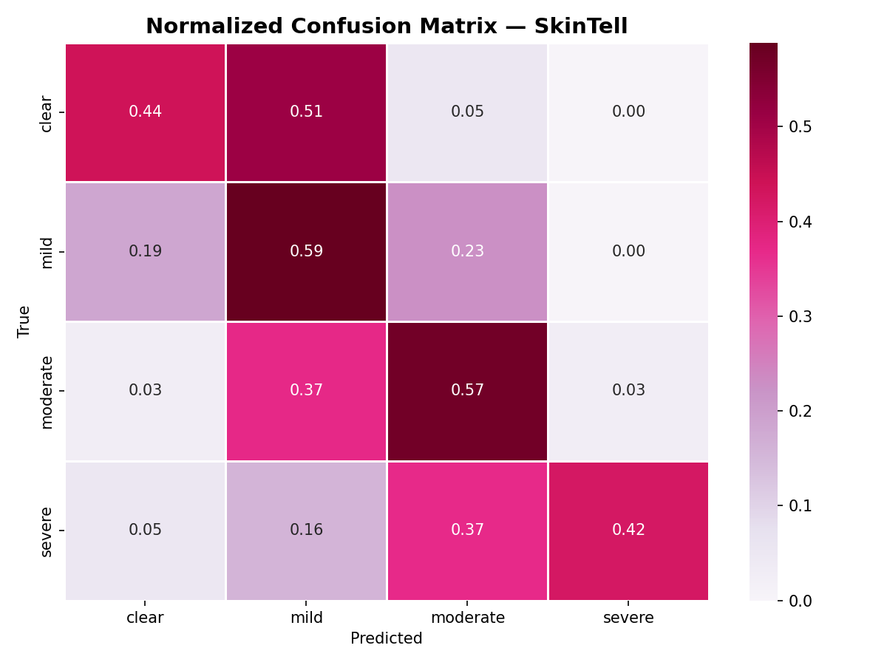

# SkinTell 🧴

A computer vision web app that classifies acne severity from facial images using deep learning and transfer learning with MobileNetV2.

Upload a photo → get an instant severity prediction: **Clear, Mild, Moderate, or Severe**.

---

## Demo


---

## Project Structure

```
SkinTell/
├── data/
│   ├── raw/              # Original downloaded dataset (not tracked)
│   └── processed/        # Cleaned, resized, split images (not tracked)
├── notebooks/
│   ├── 01_data_exploration.ipynb
│   ├── 02_preprocessing.ipynb
│   ├── 03_modeling.ipynb
│   └── 04_evaluation.ipynb
├── models/               # Saved model weights (not tracked)
├── plots/                # Output visualizations
├── app.py                # Streamlit web app
├── requirements.txt
└── README.md
```

---

## Dataset

This project uses the **ACNE04 dataset** from Kaggle, downloaded automatically via `kagglehub`.

| Class | Folder | Images |
|---|---|---|
| Clear | acne0_1024 | 483 |
| Mild | acne1_1024 | 623 |
| Moderate | acne2_1024 | 175 |
| Severe | acne3_1024 | 96 |
| **Total** | | **1377** |

The dataset is heavily imbalanced — handled using class weights during training.

**Setup Kaggle API access:**
1. Go to kaggle.com → Settings → API → **Create New Token**
2. Run in your terminal:
```powershell
# Windows
[System.IO.File]::WriteAllText("$HOME\.kaggle\access_token", "your_token_here")

# Mac/Linux
mkdir -p ~/.kaggle && echo "your_token_here" > ~/.kaggle/access_token && chmod 600 ~/.kaggle/access_token
```
3. The dataset downloads automatically when running notebook 01.

---

## Getting Started

```bash
# 1. Clone the repo
git clone https://github.com/Maggarb/SkinTell.git
cd SkinTell

# 2. Create a virtual environment with Python 3.11
py -3.11 -m venv .venv311
.venv311\Scripts\activate  # Windows

# 3. Install dependencies
pip install -r requirements.txt

# 4. Run the app
streamlit run app.py
```

To reproduce the model, run notebooks in order (01 → 04) before running the app.

---

## Approach

1. **Exploratory Analysis** — class distribution, sample images, confirmed all images are 1024x1024
2. **Preprocessing** — resize to 224x224, normalize, augment (flip, rotate, brightness, zoom), compute class weights to handle imbalance
3. **Modeling** — two-phase transfer learning with MobileNetV2:
   - Phase 1: base model frozen, train top layers only
   - Phase 2: unfreeze top 30 layers for fine-tuning with lower learning rate
4. **Evaluation** — confusion matrix, per-class precision/recall, sample predictions with confidence scores

---

## Key Findings

- The model performs best on **mild** (59% recall) and **moderate** (57% recall) classes
- **Clear** and **mild** are frequently confused — visually similar at the boundary
- **Severe** class is the hardest to classify correctly due to limited training data (only 96 images)
- Class imbalance is the main limiting factor — more severe and moderate images would significantly improve performance
- The boundary between severity levels is inherently subjective, which adds noise to the labels

---

## Confusion Matrix



---

## Limitations & Ethics

- This model is **not a medical diagnostic tool**. It is a learning project only.
- Performance is limited by dataset size, especially for severe cases (96 images)
- The dataset has limited demographic diversity — predictions may be less accurate across all skin tones
- Acne severity is subjective — even dermatologists may disagree on borderline cases
- Always consult a dermatologist for medical advice

---

## Tech Stack

- Python 3.11
- TensorFlow / Keras
- MobileNetV2 (pretrained on ImageNet)
- scikit-learn
- Streamlit
- Matplotlib, Seaborn
- kagglehub
